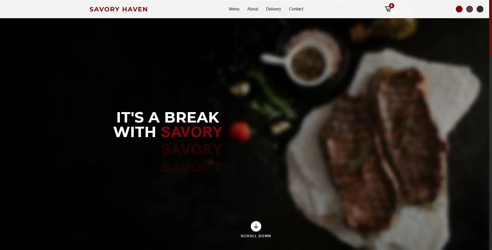

# Savory Haven - Fine Dining Experience 🍽️

Savory Haven is a modern restaurant website that offers a premium dining experience with a beautifully designed interface, engaging animations, and a seamless user experience.

## 🖼️ Website Preview


## 🌟 Features
- Elegant and responsive design
- Interactive 3D background using Three.js
- Theme switcher with multiple color options
- Smooth animations and parallax effects
- Interactive menu with "Add to Cart" functionality
- Local storage integration for cart persistence
- Optimized for SEO and social media sharing (Meta Tags included)

## 🚀 Live Demo
[Visit Savory Haven](https://hastrs.github.io/Savory-Haven/)

## 🛠️ Technologies Used
- **HTML5** - Semantic structure
- **CSS3** - Modern styling with animations
- **JavaScript (ES6+)** - Dynamic interactions
- **Three.js** - 3D background elements
- **LocalStorage** - Cart data persistence

## 📂 Project Structure
/project-root
├── index.html
├── style.css
├── script.js
├── /img (contains all images)
├── README.md
├── LICENSE

## 🛠️ How to Run Locally
1. Clone the repository:
   ```sh
   git clone https://hastrs.github.io/Savory-Haven/.git
2. Open index.html in a browser.
ts
Integrate a backend for real order processing
Add user authentication for a personalized experience
Implement a full checkout system with payment integration
📝 License
This project is licensed under the MIT License. See the LICENSE file for more details.

👨‍💻 Author
Hassan El Sayed

GitHub | Website | LinkedIn
